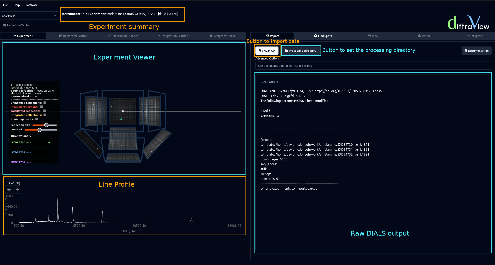

==================
Importing Data
==================

To import data, under the import tab click the Browse button. This will open a
file dialog that will allow you to select one or multiple files. If more than 
one file is selected, DIALS treats these files as different orientations of the
same experiment. 

After opening files the output of DIALS will be shown on the algorithm panel.
Along the top of the GUI a summary is given of the experiment. This will include
more information as you proceed through data processing.
In the viewer panel the first orientation will be shown in detector space. Moving
the mouse over a detector panel in this viewer will show the panel name and 
coordinates. Clicking on a panel will generate the line profile along the 
time-of-flight direction in the lineplot, shown underneath the experiment viewer. 
In the experiment viewer menu (toggled by pressing s), different orientations 
can be shown by selecting from the orientations dropdown menu. Importing 
data enables the Find Spots tab in the algorithm panel. The full dials importing
documentation can be found `here <https://dials.github.io/documentation/programs/dials_import.html>`_.

