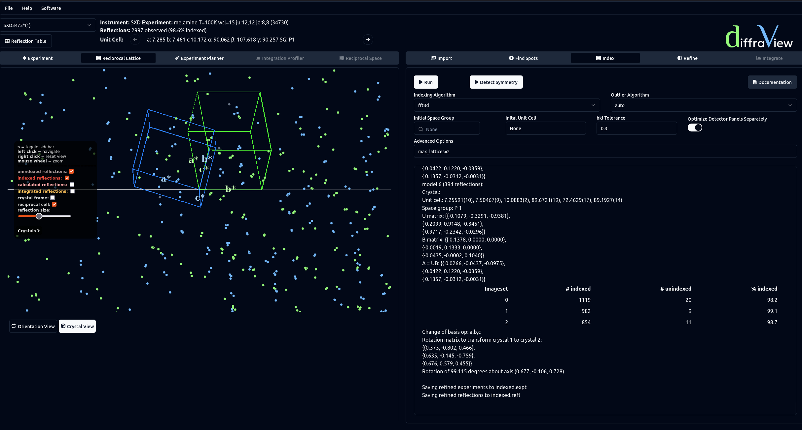

==================
Indexing
==================

DIALS supports several indexing algorithms for detecting periodicity. An overview
of the different approaches is given `here <https://journals.iucr.org/d/issues/2018/02/00/di5011/index.html>`_.
An initial space group and unit cell can be given, however for both the 1D and 3D
FFT methods can also be run with no initial guess. If no initial values are given 
the resulting unit cell will be in P1. As part of indexing some initial refinement 
is done for the obtained UB matrix. Selecting Optimize Detector Panels Separately 
will allow the position and orientation of individual panels to be optimised, as opposed to 
treating the entire detector as one rigid body. A full list of input options is given 
`here <https://dials.github.io/documentation/programs/dials_index.html>`_.

If multiple lattices are known to be present in the same, max_lattices=n, where
n is the expected number of lattices, can be entered in the Advanced Options 
input.

After indexing has completed, the indexed reflections are shown in the Experiment
and Reciprocal Lattice Viewers and the Refine algorithm tab is enabled. 
Symmetry can also be applied via the Detector Symmetry
button. This will show a list of lattices with increasing symmetry, and the resulting 
error introduced by applying the symmetry. By clicking on one of these lattices, 
the unit cell will update and all refletions will be reindexed automatically.

The Reciprocal Lattice viewer can show the indexed reflections by orientation 
or by crystal. The Crystal View button shows the latter, where reflections are 
coloured based on which lattice they have been assigned.

Obtaining a unit cell unlocks the Experiment Planner viewer. This can be used to 
calculate the expected reflections for a given orientation and a given resolution 
(dmin). Clicking Calculate will show expected spots for all orientations currently loaded.
Additional orientations can then be investigated by manually updating the phi goniometer 
(as shown in the Experiment Planner options sidebar), or by clicking the Next Best button.
In the latter case, a scan will be done to obtain the next orientation that gives the most 
additional unique reflections compared to what has already been calculated. All 
reflections in the Experiment Planner viewer are for the asymmetric unit only. 

