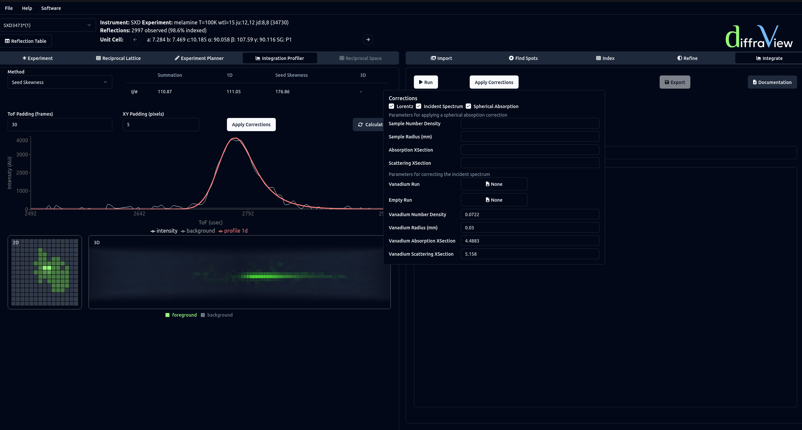

==================
Integration
==================

DIALS supports integration via shoebox summation, seed-skewness, and profile fitting.
The 1D profile refers to a Gaussian convolved with two back-to-back exponential functions,
as described `here <https://www.nature.com/articles/srep36628.pdf>`_.

Before running integration, the Integration Profiler viewer can be used to 
observe the quality of fit for a given reflection. With the viewer open, 
clicking on a reflection in the Reflection Table will show the performance 
of a given algorithm.

Integration can be run with and without corrections. Corrections can be applied via the 
Apply Corrections button. Here the Lorentz, incident spectrum and a spherical absorption correction 
can be applied. Any corrections applied in the Integration Profiler tab 
will be carried over to the Integrate algorithm tab, and vice versa. 
After integration, the Export button can be used to output the data as a .hkl file.

