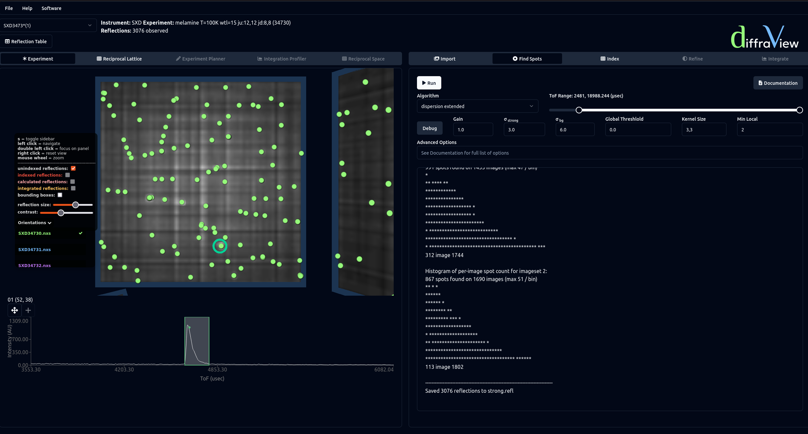

==================
Spot Finding
==================

DIALS has several methods for identifying Bragg peaks. The dispersion algorithms 
are described in 3.1 of `this paper <https://journals.iucr.org/d/issues/2018/02/00/di5011/index.html>`_, 
and `here <https://github.com/graeme-winter/dials_tutorials/blob/main/algorithms/spot_finding.md>`_.
Both of these methods iterate over all pixels, looking at neighbouring pixels to 
determine if the given pixel satisfies a series of thresholds. Strong pixels are
then joined together to define the shoebox of a given reflection. The radial profile
algorithm is described `here <https://github.com/dials/dials/pull/2009>`_. 

When selecting different algorithms under the Algorithm dropdown, some key
parameters are shown. When setting the ToF range, if a pixel is highlighed in the
experiment viewer the line profile will grey out data outside of the range. A 
full list of additional options that can be entered in the Advanced Options 
input is given `here <https://dials.github.io/documentation/programs/dials_find_spots.html>`_.

After running spot finding, spots are shown in the Experiment viewer. The size of
these can be changed using the reflection size slider in the experiment viewer options
(shown by pressing s when the experiment viewer is highlighed). Bounding boxes can 
also be viewed from these options. If the line profile is showing a pixel that forms part
of a reflection, the bounding box and centroid are now shown in the line profile.

In addition, the Reciprocal Lattice viewer can now be used, showing reflection centroids in
reciprocal space. In the top left corner, information about the reflections can be
viewed directly via the Reflection Table button. When looking at the Experiment viewer,
clicking on reflection in the reflection table will rotate the Experiment viewer to show
its position on the detector. Any reflections can be removed manually be right-clicking
on the reflection in the Reflection Table. 

